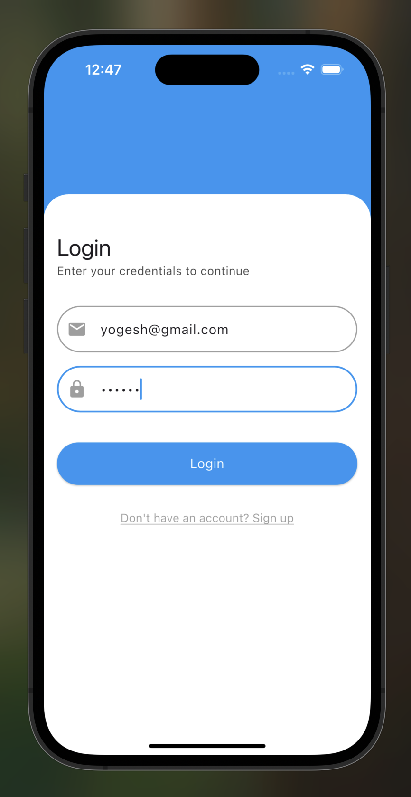
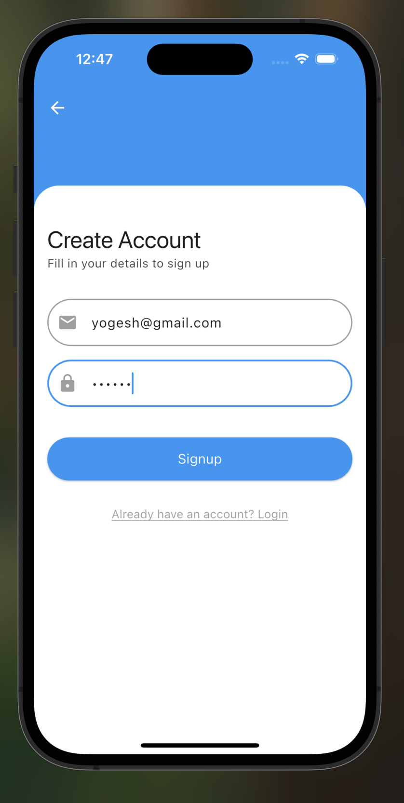
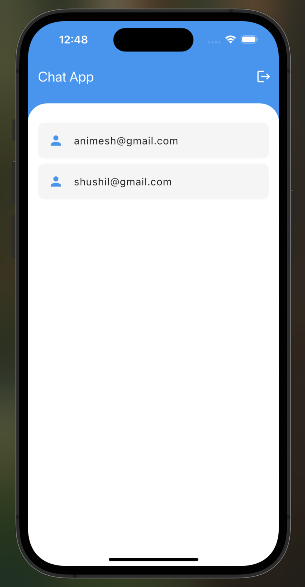
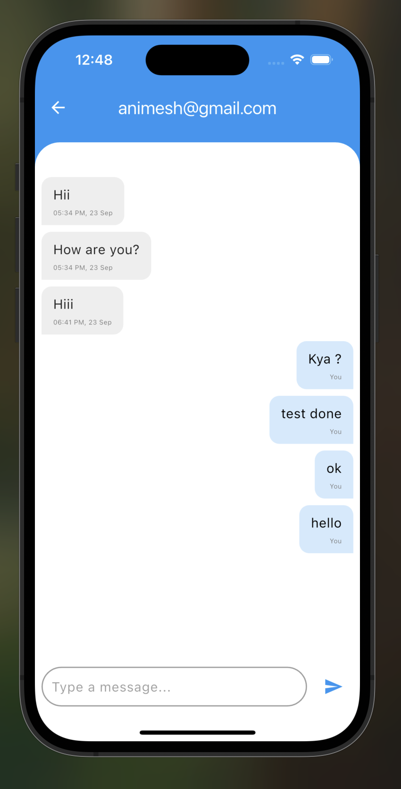

# Real-Time Chat Application

A real-time 1-on-1 chat application built with **Flutter**, **Node.js**, **MongoDB**, and **Socket.IO**. Users can register, login, view all registered users, and chat privately. Each chat is private and not visible to other users.

---

## Features

- **User Authentication**
  - Signup
  - Login
  - Logout
- **User Management**
  - View all registered users
  - Tap a user to start private chat
- **Real-Time Messaging**
  - Send and receive messages instantly
  - Messages are one-to-one; not visible to other users
- **Persistence**
  - Messages are stored in MongoDB
  - Previous conversations are loaded when a user opens a chat

---

## Test User Credentials

Use the following account to quickly test the app:

- **Email:** `yogesh@gmail.com`  
- **Password:** `yogesh`

---

## Screenshots






> Make sure the `assets` folder is committed to the repository so the images appear on GitHub.

---

## Tech Stack

- **Frontend:** Flutter + Dart
- **Backend:** Node.js + Express.js
- **Database:** MongoDB
- **Realtime:** Socket.IO
- **State Management:** Bloc (Flutter)
- **Storage:** GetStorage (Flutter)

---

## Backend Setup

1. Navigate to the backend folder:

```bash
cd chat-backend
