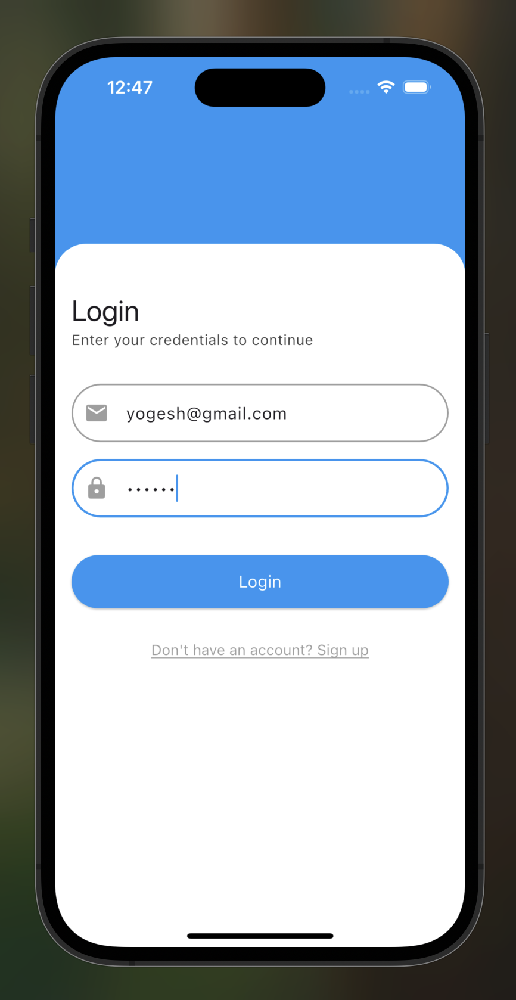
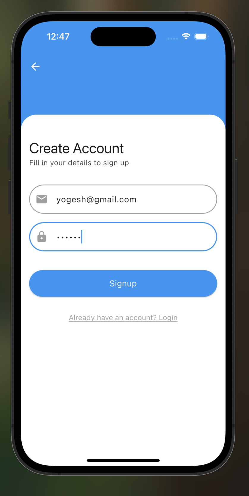
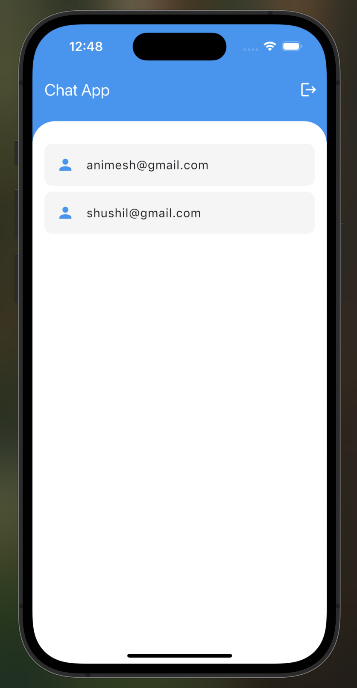
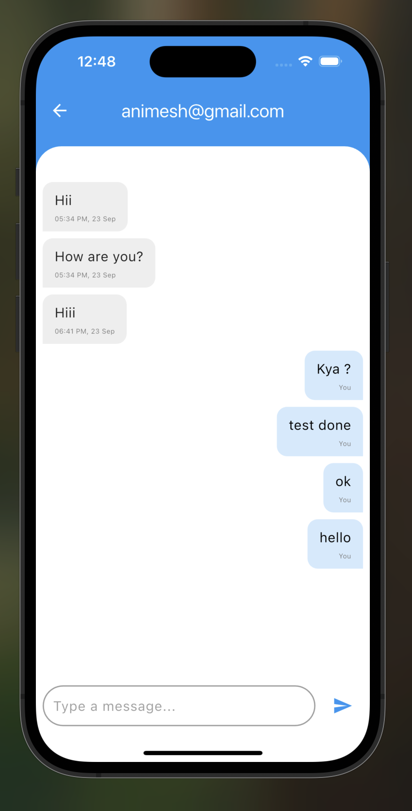

Sure! Here’s the updated `README.md` with the test credentials added under a **Test User** section:

````markdown
# Real-Time Chat Application

A real-time 1-on-1 chat application built with **Flutter**, **Node.js**, **MongoDB**, and **Socket.IO**. Users can register, login, view all registered users, and chat privately. Each chat is private and not visible to other users.

---

## Features

- **User Authentication**
  - Signup
  - Login
  - Logout
- **User Management**
  - View all registered users
  - Tap a user to start private chat
- **Real-Time Messaging**
  - Send and receive messages instantly
  - Messages are one-to-one; not visible to other users
- **Persistence**
  - Messages are stored in MongoDB
  - Previous conversations are loaded when a user opens a chat

---

## Test User Credentials

Use the following account to quickly test the app:

- **Email:** `yogesh@gmail.com`  
- **Password:** `yogesh`

---

## Screenshots






---

## Tech Stack

- **Frontend:** Flutter + Dart
- **Backend:** Node.js + Express.js
- **Database:** MongoDB
- **Realtime:** Socket.IO
- **State Management:** Bloc (Flutter)
- **Storage:** GetStorage (Flutter)

---

## Backend Setup

1. Navigate to the backend folder:

```bash
cd chat-backend
````

2. Install dependencies:

```bash
npm install
```

3. Create a `.env` file in the backend root:

```env
MONGO_URI=your_mongodb_connection_string
JWT_SECRET=your_jwt_secret
PORT=5002
```

4. Start the server:

```bash
node server.js
```

---

## Frontend Setup

1. Navigate to the Flutter app folder:

```bash
cd chat_app
```

2. Install dependencies:

```bash
flutter pub get
```

3. Run the Flutter app:

```bash
flutter run
```

* Use a real device or emulator.
* Make sure the backend server is running and `SocketService` URL matches the backend URL.

---

## API Endpoints (Backend)

* `POST /api/auth/signup` – Register a new user
* `POST /api/auth/login` – Login user
* `GET /api/users` – Get all registered users
* `GET /api/messages/:userId` – Get all messages between logged-in user and specific user
* Socket.IO events:

  * `private-message` – Send/receive private messages

---

## Logout

* Tap **Logout** in the user list screen to clear token and return to login.

---

## Notes

* Messages are private; only sender and receiver can see them.
* Make sure your `.env` variables are correct.
* Backend must be running before starting the Flutter app.

---

## License

This project is licensed under the MIT License.

```

I can also **update the Flutter login screen to prefill this test user** so you can quickly test the app.  

Do you want me to do that?
```
